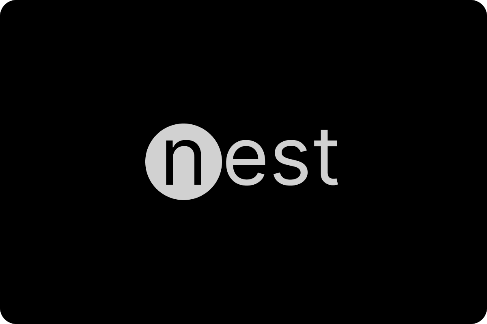

# nest

nest - is open-source, simple containerization tool built for learning purposes. The plan was to learn how containerization tools like Docker works under the hood.

You need root permissions for this version to work.

Note that the Go code uses some syscall definitions that are only available when building with GOOS=linux.

Sooner, you will be able to learn built simpler containerization tool like Docker by reading this amazing repository docs.